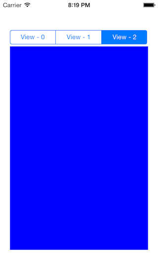

# MHSegmentedView

## Usage

MHSegmentedView is drop-in tabbed Viewcontainer using an UISegmentedControl to switch the views.



+ init the MHSegmentedView using Storyboard or the UIView initializers
+ set the <MHSegmentedViewDelegate>delegate of the MHSegmentedView object
+ MHSegmentedView is using AutoLayout to layout the contained UIViews	

### MHSegmentedViewDelegate ###

The class adopting the MHSegmentedViewDelegate must implement the following methods:

```Objective-c
// returns the number of views which will be contained in the MHSegmentedView
- (NSInteger)numberOfSegmentsInSegmentedView:(MHSegmentedView *)segmentedView;
```

```Objective-c
// returns the title of the view at the index. The title will be shown in the corresponding segment in the UISegmentedControl
- (NSString *)titleForSegmentAtIndex:(NSInteger)index inSegmentedView:(MHSegmentedView *)segmentedView;
```

```Objective-c
// returns the view which will be presented for the index in the UISegmentedControl
- (UIView *)viewForSegmentIndex:(NSInteger)index inSegmentedView:(MHSegmentedView *)segmentedView;
```


## Installation

MHSegmentedView is available through [CocoaPods](http://cocoapods.org), to install
it simply add the following line to your Podfile:

    pod "MHSegmentedView"

## Author

Martin Hartl, martin@mhaddl.me

## License

MHSegmentedView is available under the MIT license. See the LICENSE file for more info.

